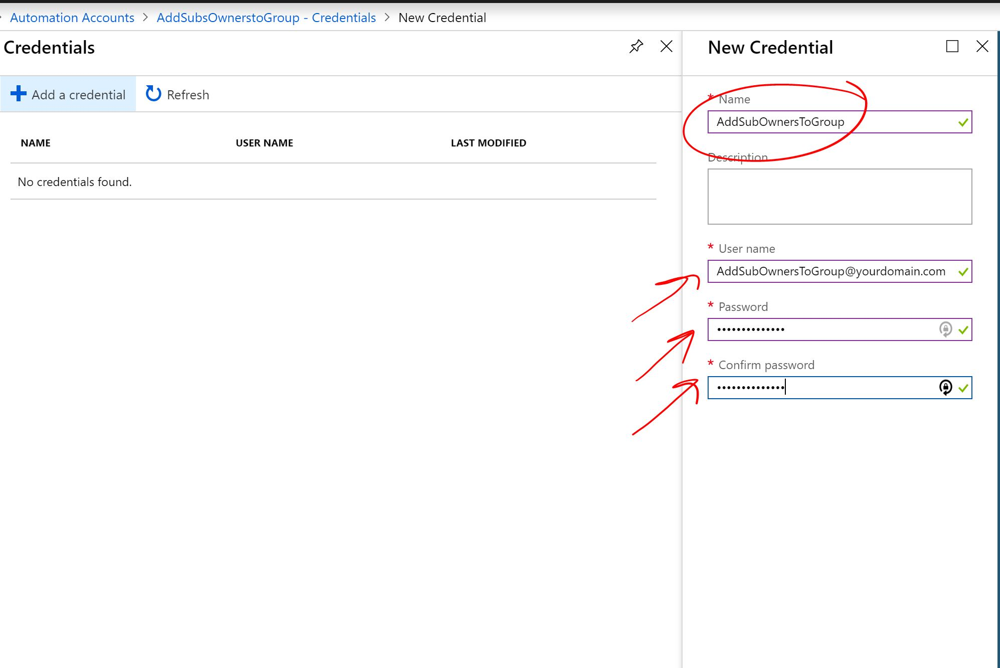

# Azure Automation to add all Subscription owners to an Azure AD Group

This scription is designed to add all owners of all your subscriptions to an Azure AD Group.

The user running the script has to have the needed permissions.

## Why would you need that?
Usually if let's say you need to make sure all Subscription Owners are forced to use MFA, you can create a conditional policy in Azure AD and apply it to this group.

## How to use

### Create a user account
You need to a add a user to be used for this Automation. The User has to be an owner of the group you need to add the members to.

Here is a step by step on how to create an Azure AD User: 
    https://docs.microsoft.com/en-us/azure/active-directory/fundamentals/add-users-azure-active-directory#add-a-new-user

Here is a step by step article on how to make a user a group owner:
    https://docs.microsoft.com/en-us/azure/active-directory/fundamentals/active-directory-accessmanagement-managing-group-owners#add-an-owner-to-a-group

The user account will have to be a reader on all subscriptions, or in a group which has reader access. Otherwise it won't be able to read the permissions.

Please login with the user one time to make sure its working, in most cases you will need to change the password on the first login (will be needed below)

### Create an Automation Account

Now you need to create an Azure Automation Account.

Click on "All services" then type "auto" and choose "Automation Account"


Click "Add"


Choose a name, a subscription, Resrouce Group, Location and the Run As account has to be set to "Yes"


You may need to hit "Refresh"


Click to open the new Automation Account


Click on Modules Gallery on the left, search for "AzureAD" click on it and import it. You need to do the same for "MSOnline" module as well.


Now go back to your Automation Account, click on "Credentials" and then "Add a credential"


Here you will need to add the user account that you have created above, and type the password you have created above 2 times. Also make sure to note the Name and the Username as you will need to add them to the script.




Once done, go to "Runbooks" and click to add a new Runbook, that will be our code.


Click "Quick Create", choose a name and "Powershell" as the type and then click create.


Now you need to past the code, however make sure to change the line in red (see screen shot)

1.This is the group ID we have created above

2.Here you need to add the "Name" (not the username) of the user to run the script

3.This command will pull all subscriptions owners, ..etc. you need to edit this if you need other roles (e.g. only Readers?)

...If you need all members you can leave this as is.

...If you need only owners you need to change this to be:

       ```
       $usersList = (Get-AzureRmRoleAssignment -IncludeClassicAdministrators -scope $substring | Where-Object {$_.RoleDefinitionName -like "*AccountAdministrator*" -or $_.RoleDefinitionName -like "owner" -or $_.RoleDefinitionName -like "*ServiceAdministrator*")
       ```
       
4. Here is the username of the user running the script (not the name)
    


Then press "Save" then "Publish"


Now you can press Start to test it, then go to Jobs to check it. You can schdule it also if needed.


Many thanks to Esmaeil and his article which was the source for this repo: http://en.gravatar.com/esarabadani

Best of Luck

MoGa
